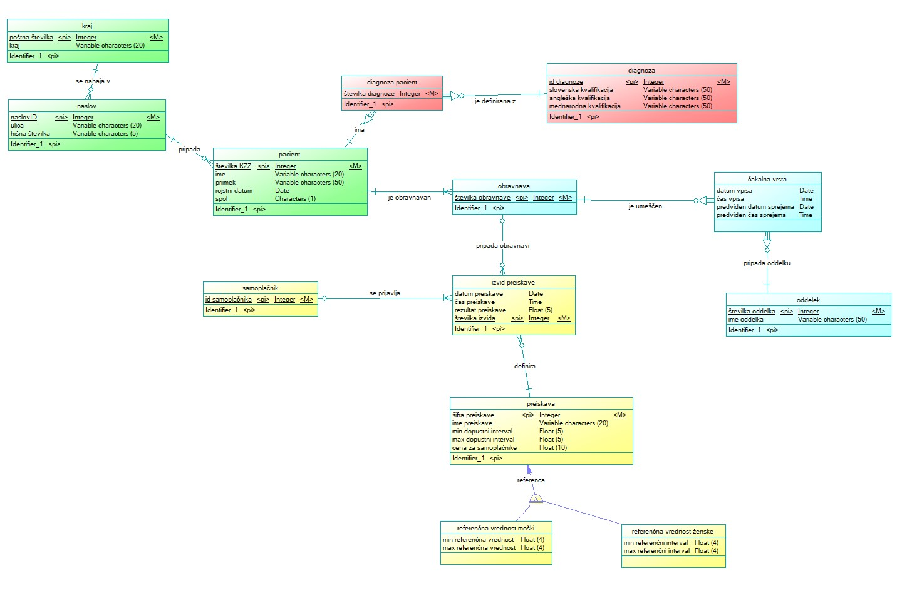

# 1. domača naloga - konceptualni model zdravstvenega doma

> ## Navodila
>Predstavljajmo si zdravstveni dom, ki ga sestavlja več oddelkov in laboratorij. Zdravstveni dom obiskujejo pacienti, opisani s številko kartice zdravstvenega zavarovanja (KZZ), imenom, priimkom, rojstnim datumom, spolom in naslovom. Ob začetku zdravljenja se pacientu dodeli številka obravnave, ki ga spremlja skozi celoten potek zdravljenja. Pacient se lahko zdravi na enem ali več oddelkih. Vsak izmed oddelkov je opisan s številko oddelka in imenom.
>
>Oddelki imajo različne čakalne vrste v katere se vpišejo pacienti po dodelitvi številke obravnave in ugotovljeni potrebi po oddelku. Čakalna vrsta vsebuje podatke o številki obravnave, zahtevanem oddelku, datumu in času vpisa in predvidenem datumu in času sprejema na oddelek.
>
>Pacientu tekom zdravljenj opravljajo določene laboratorijske preiskave. Te so opisane s šifro preiskave, ter datumom in časom preiskave  (npr. odvzema krvi). Vsaka laboratorijska preiskava je opisana tudi z imenom, dopustnim intervalom vrednosti (min-max), ter referenčnimi vrednostmi (interval min-max), ki je pogosto različen za moške in ženske.
>
>Na posamezne laboratorijske preiskave se lahko naročijo tudi samoplačniki, ki trenutno niso na zdravljenju v zdravstvenem domu. Pri preiskavah je določena tudi cena za samoplačnike. Predlagajte, kako se lahko na najbolj enostaven način vključijo tudi taki primeri.
>
>Med in ob koncu zdravljenja se pacientu postavi ena ali več diagnoz. Diagnoze so oštevilčene (začenši z 1) in opisane po mednarodni klasifikaciji bolezni (ICD) po najmanj enem izmed sistemov: slovenski (SLO), ameriški (USA), mednarodni (WHO). Vsaka bolezen je opisana z ICD kodo, slovenskim in angleškim imenom, ter morda še kakšnimi drugimi atributi (primeri so v priponki).
>
>(a) V podanem tekstu identificirajte gradnike ER modela: atribute, entitetne tipe, identifikatorje, razmerja. Razmislite in opišite ali (če sploh) je potrebno dodati še kakšne nove/umetne/izračunane atribute.  
>
>(b) Z orodjem PowerDesigner izdelajte entitetno-relacijsko shemo, ki predstavlja opisani zdravstveni dom.
>
>(c) Razmislite, kakšne smiselne omejitve poleg navedenih še veljajo v našem zdravstvenem domu. Opišite, katere lahko upoštevamo v ER modelu in katerih ne.
>
>Rezultate predstavite v obliki poročila, ki ga oddate v datoteki PDF (ne Word, ne ZIP ali kakšen drug arhiv; samo PDF).

## Gradniki ER modela
### Entitetni tipi in njihovi atributi

#### Entitetni tip: pacient
Atributi entitetnega tipa:
*   številka kartice zdravstvenega zavarovanja (Integer, enolična, uporabnimo jo kot identifikator)
*   ime (varchar)
*   priimek (varchar)
*   rojstni datum (date)
*   spol (char)

#### Entitetni tip: naslov
Atributi entitetnega tipa:
*   naslovID (Integer, enoličen, identifikator)
*   ulica (varchar)
*   hišna številka (varchar)
Dodamo umetni entitetni tip *naslovID*. Tako omejimo identifikator na samo en atribut, alternativa bi bila, da identifikator sestavimo iz *ulica* in *hišna številka*. Pacientu lahko pripada samo en naslov, v bazi ne hrani zgodovine naslovov pacienta.

#### Entitetni tip: kraj
Atributi entitetnega tipa:
*   poštna številka (Integer, enoličen, identifikator)
*   mesto (varchar)

#### Entitetni tip: obravnava
Atributi entitetnega tipa:
*   številka obravnave (Integer, enoličen, identifikator)

#### Entitetni tip: oddelek
Atributi entitetnega tipa:
*   številka oddelka (Integer, enoličen, identifikator)
*   ime oddelka (varchar)

#### Šibki entitetni tip: čakalna vrsta
Atributi entitetnega tipa:
*   datum vpisa (date)
*   čas vpisa (time)
*   predvideni datum sprejema (date)
*   predviden čas sprejema (time)

#### Entitetni tip: izvid preiskave
Atributi entitetnega tipa:
*   številka izvida (Integer, enoličen, identifikator)
*   datum preiskave (date)
*   čas preiskave (time)
*   rezultat preiskave (varchar)
Dodamo umetni entitetni tip *številka izvida*. Tako razdelimo na najenostavnejši način razdelimo samoplačnike in paciente na zdravljenju in jih v entitetnem tipu *izvid preiskave* ne ločujemo.

#### Entitetni tip: samoplačnik
Atributi entitetnega tipa:
*   šifra samoplačnika (Integer, enoličen, identifiaktor)

#### Entitetni tip: preiskava
Atributi entitetnega tipa:
*   šifra preiskave (Integer, enoličen, identifikator)
*   ime preiskave (varchar)
*   min dopustni interval vrednosti (float)
*   max dopustni interval vrednosti (float)
*   cena za samoplačnike

##### Specializiran entitetni tip: referenčna vrednost moški
Atributi entitetnega tipa:
*   min referenčni interval vrendosti (float) 
*   max referenčni interval vrednosti (float)

##### Specializiran entitetni tip: referenčna vrednost ženska
Atributi entitetnega tipa:
*   min referenčni interval vrendosti (float) 
*   max referenčni interval vrednosti (float)

#### Šibki entitetni tip: diagnoza pacient
Atributi entitetnega tipa:
*   številka diagnoze (Integer)

#### Entitetni tip: diagnoza
Atributi entitetenga tipa:
*   id diagnoze (Integer, enoličen, identifikator)
*   slovenska kvalifikacija (varchar)
*   angleška kvalifikacija (varchar)
*   mednarodna kvalifikacija (varchar)

### Razmerja

| Entitetni tip | Razmerje | Entitetni tip |
|---------------|----------|---------------|
|kraj|(1,1) - (0,n) |naslov|
|naslov|(1,1) - (0,n)|pacient|
|pacient|(1,1) - (0,n)|diagnoza pacient|
|diagnoza pacient|(0,n) - (1,1)|diagnoza|
|pacient|(1,1) - (1,n)|obravnava|
|obravnava|(1,1) - (0,n)|čakalna vrsta|
|čakalna vrsta|(0,n) - (1,1)|oddelek|
|obravnava|(0,1) - (0,n)|izvid preiskave|
|izvid preiskave|(0,1) - (1,n) | samoplačnik |
|izvid preiskave|(0,n) - (1,1)|preiskava|

## Konceptni model
